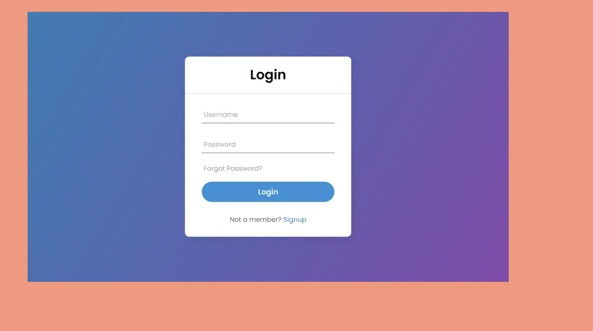

# Execute Code:
Assigment-1 (Login Screen) : `yarn slf` 
Assigment-2 (Linkedin Post) : `yarn swl` 
Assigment-3 (JS Practice) : `yarn start` 

# vanilla-js-template
Vanilla JS Project template for Modanisa Bootcamp

First, you need to ensure that `yarn` installed on your pc.

After that, you can install all dependencies specified package.json with below code
`yarn install`

After installing dependencies execute `yarn start` and check http://localhost:1234

## Submit structure
There is a branch for every assigment on GitHub. Before writing the make sure that you
are on assignment's branch and do not forget to commit and push the changes you make 
to the remote repository.

## Assignment-1 (Login Screen)

For execute: `yarn slf` 

For the first assigment, you need to prepare a login screen which is centered on the screen.

### Evaluation Criterion
- You need to use class, id or attribute selector. Do not use inline styles.
- You need to use flexbox.
- You need to center login card both vertically and horizontally.
- All elements inside the login card should be centered.
- For bonus points, you need to give pay extra attention to the colors, border radius fonts.

## Assignment-2 (Linkedin Post)

For execute: `yarn swl`

For this assigment, you need to prepare a Linkedin post.

### Evaluation Criterion
- You need to use class, id or attribute selector. Do not use inline styles.
- You need to use flexbox.
- Elements should be placed roughly as you see in the picture below.
- For bonus points, you need to give pay extra attention to the colors, border radius and fonts.

## Assignment-3 (JS Practice)

For execute: `yarn start` 

This assigment is about JS. All the steps you need to complete written in app.js file.
